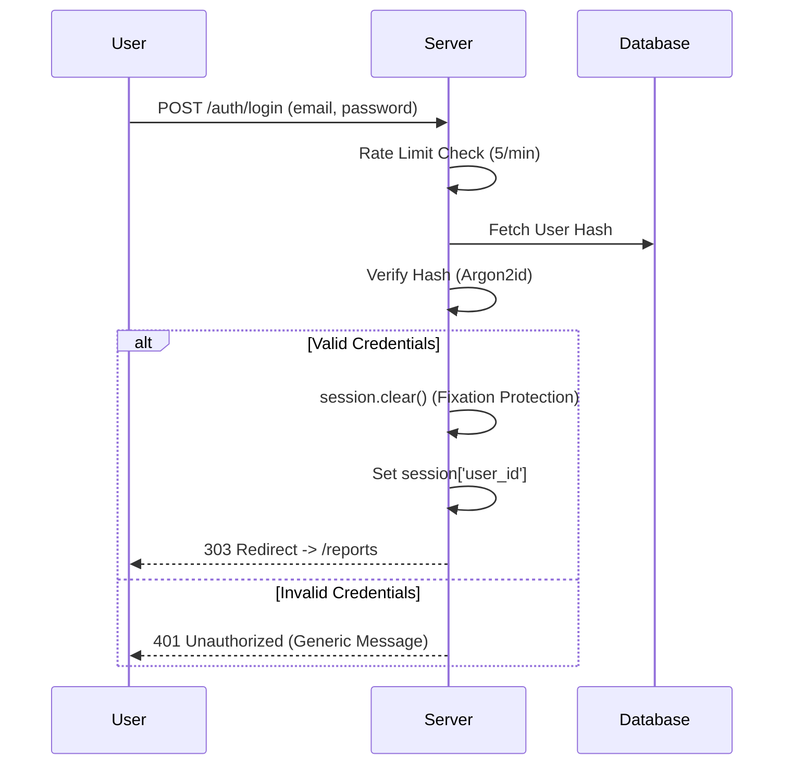

# Authentication, Sessions, and CSRF

This document details the authentication flow, session management, and CSRF protection mechanisms in **SecureLeak**.

---

## 🔐 Authentication Flow

The application uses a standard session-based authentication flow with strict security controls.



### Why Session-Based Auth? (Exam Note)
We chose **stateful session cookies** over JWTs (JSON Web Tokens) because:
1.  **Simplicity**: No need to manage token storage or expiration manually on the client.
2.  **Security**: Cookies can be made `HttpOnly` (XSS-proof), whereas JWTs in `localStorage` are vulnerable to XSS.
3.  **Revocation**: Server-side sessions can be invalidated instantly (e.g., on logout or password change), which is harder with stateless JWTs.

### Password Hashing (Argon2id)

We use **Argon2id**, the winner of the Password Hashing Competition, configured with parameters that make it memory-hard and resistant to GPU cracking.

```python
# security/auth_utils.py
def build_hasher() -> PasswordHasher:
    """Create a PasswordHasher with explicit Argon2id parameters."""
    return PasswordHasher(
        time_cost=3,        # Iterations
        memory_cost=65536,  # 64 MiB RAM usage
        parallelism=2,      # Threads
        hash_len=32,
        salt_len=16,
    )
```

### Account Enumeration Prevention
Login failures return a generic "Invalid email or password" message and a 401 status code, regardless of whether the email exists or the password was wrong. This prevents attackers from verifying which emails are registered.

---

## 🍪 Session Management

We use Flask's secure cookie sessions with the following attributes enforced in `app.py`:

*   **`HttpOnly`**: `True`. Prevents JavaScript (XSS) from reading the session cookie.
*   **`SameSite`**: `"Lax"`. Prevents the browser from sending the cookie on cross-site POST requests (CSRF mitigation).
*   **`Secure`**: `True` (in production). Ensures the cookie is only sent over HTTPS.

**Session Fixation Protection**:
We explicitly call `session.clear()` before setting the user identity upon successful login.

---

## 🛡️ CSRF Protection

We use the **Synchronizer Token Pattern** via `Flask-WTF`.

1.  **Generation**: A unique, cryptographically strong token is generated for each session.
2.  **Injection**: The token is injected into forms via `{{ csrf_token() }}`.
3.  **Validation**: On POST, the server verifies the token matches the session's token.

**Failure Handling**:
Missing or invalid tokens raise a `CSRFError`, which is caught by a global error handler to render a friendly 400 Bad Request page.

---

## 🚦 Rate Limiting

To prevent brute-force attacks, we limit authentication endpoints:

*   **Login**: 5 attempts per minute per IP.
*   **Register**: 3 attempts per hour per IP.

This is implemented using `Flask-Limiter`.
