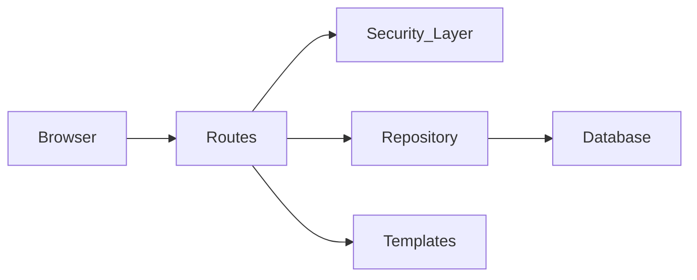

# Project Overview

**SecureLeak** is a secure whistleblowing platform designed to demonstrate **Defense-in-Depth** and **Secure-by-Design** principles. It is built as a layered Flask application, prioritizing clarity and explicit security controls over framework magic.

---

## 🏗️ Architecture

The application follows a clean separation of concerns:



1.  **Routes (`routes/`)**: Minimal HTTP handlers. They validate input format and delegate logic.
2.  **Security Layer (`security/`)**: Centralized controls for Authentication, Authorization (RBAC), Input Sanitization, and Audit Logging.
3.  **Repository (`repository/`)**: The *only* place where SQL is executed. Uses parameterized queries to prevent SQL Injection.
4.  **Database (`database/`)**: SQLite with strict schema enforcement.

---

## ⚙️ Core Configuration

The application is configured to be secure by default. Here is the core configuration from `app.py`:

```python
# app.py - Security Configuration
app.config.from_mapping(
    # ...
    SESSION_COOKIE_HTTPONLY=True,
    SESSION_COOKIE_SAMESITE="Lax",
    SESSION_COOKIE_SECURE=not app.debug,
    MAX_CONTENT_LENGTH=3 * 1024 * 1024,
)

# Content Security Policy (CSP) via Flask-Talisman
Talisman(
    app,
    content_security_policy={ 
        "default-src": "'self'", 
        "script-src": "'self'", 
        "style-src": "'self'", 
        "object-src": "'none'", 
        "frame-ancestors": "'none'",
        "form-action": "'self'",
        "base-uri": "'self'"
    },
    force_https=not app.debug,
    strict_transport_security=True
)
```

---

## 🧩 Key Design Choices

### 1. Defense-in-Depth
We don't rely on a single control. For example, to prevent XSS, we use:
*   **Input Validation**: Rejecting bad characters.
*   **Context-Aware Escaping**: Jinja2 auto-escaping.
*   **Content Security Policy (CSP)**: Browser-level blocking of unauthorized scripts.

### 2. KISS (Keep It Simple, Stupid)
*   **No ORM**: We use raw SQL with parameterized queries. This makes the data access layer transparent and easier to audit for security.
*   **SQLite**: Simple, file-based database that requires no complex setup, perfect for this demonstration.

### 3. Post-Redirect-Get (PRG)
All state-changing actions (POST) redirect to a view (GET) upon success. This prevents double-submission of forms and improves user experience.

---

## 📦 Tech Stack

*   **Framework**: Flask (Python)
*   **Database**: SQLite
*   **Templating**: Jinja2
*   **Security Libraries**:
    *   `Flask-Talisman`: HTTP Headers & CSP.
    *   `Flask-WTF`: CSRF Protection.
    *   `Argon2-cffi`: State-of-the-art password hashing.
    *   `Pillow`: Image processing and sanitization.
    *   `Flask-Limiter`: Rate limiting to prevent brute-force attacks.
